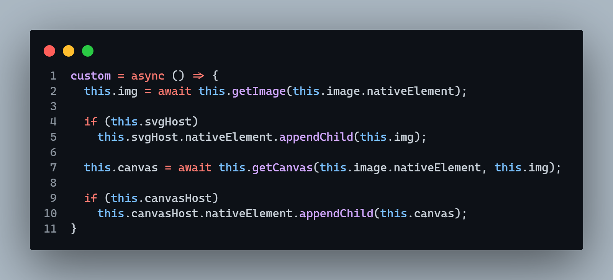
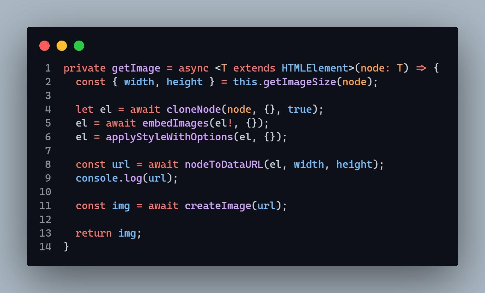
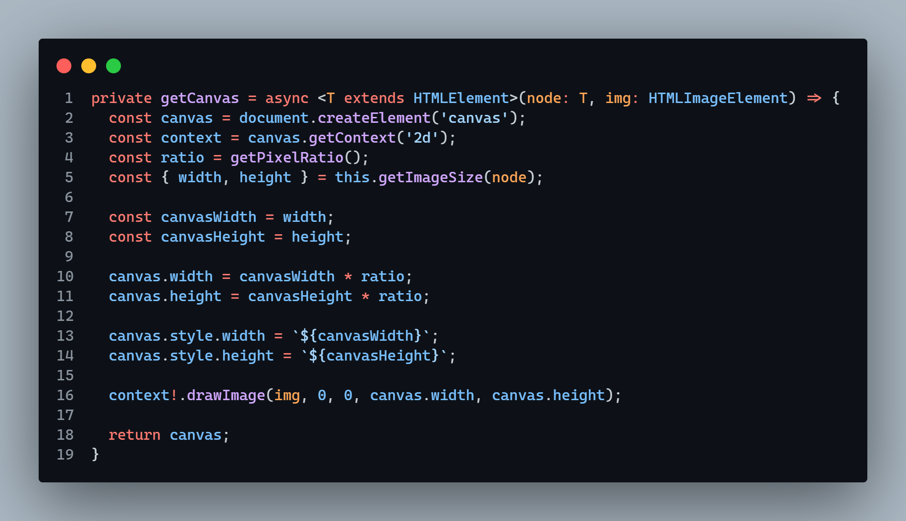
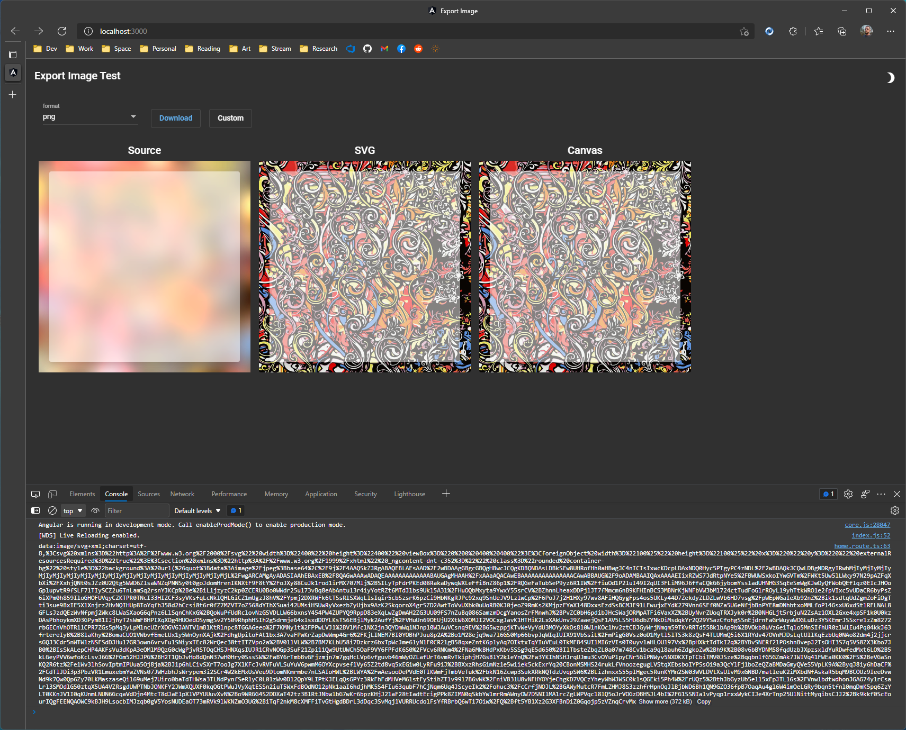
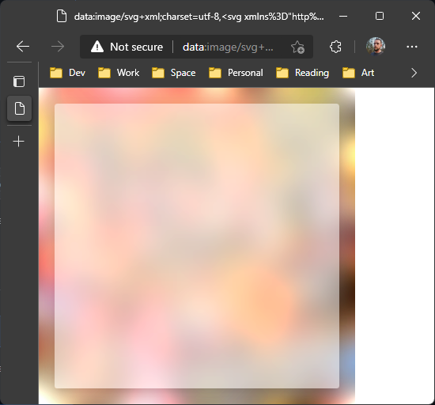

# Export Image Test

## Checking Backdrop Filter Support

The following illustrates the steps that I took to isolate at which point `backdrop-filter` is no longer included as part of the image being exported.

First, `toSvg` was broken apart into a `getImage` function. Instead of stopping where it returns the data uri, return the `HTMLImageElement` generated from the `createImage` function. `createImage` is the called directly after `toSvg` in the `toCanvas` function. `toCanvas` is the first function called in the `toPng` function.

`toCanvas` was written out as `getCanvas` so that I could directly pass in the `HTMLImageElement` and receive an `HTMLCanvasElement` in return.

A `custom` function is written and bound to the **Custom** button. It executes `getImage` and `getCanvas`, then renders the results.

See the following:

  

You will notice that neither the **SVG** rendered in an ``, nor the **Canvas**, contain the `backdrop-filter` applied in the source element tree.

However, if you open DevTools, <kbd>f12</kbd>, copy the SVG data uri generated and logged before calling `createImage` in the `getImage` function, you can copy it into the browser and it will render as anticipated.

